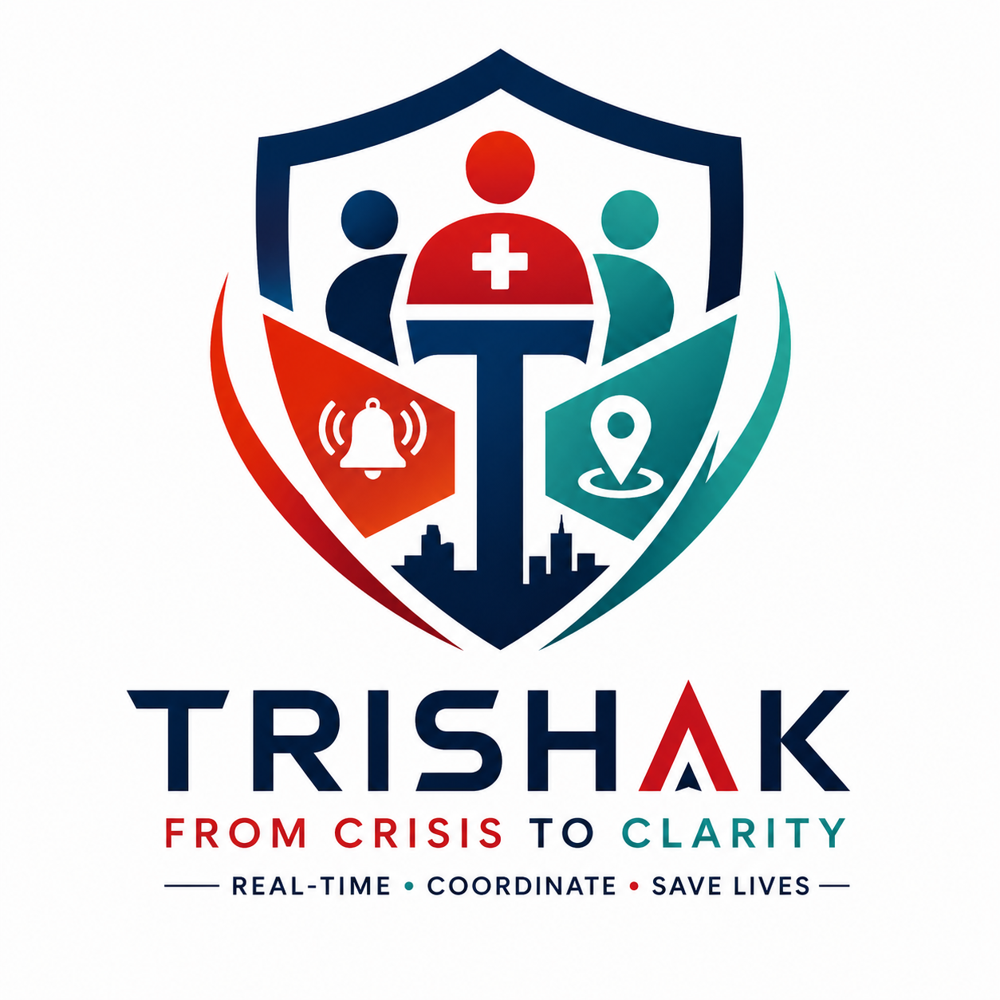

<div align="center">
  
  <br />
  

  # TRISHAK
  ### From Crisis to Clarity
  ### Real-Time • Coordinate • Save Lives
</div>

## README

### TRISHAK

Introducing TRISHAK: an AI-powered emergency response platform for hospitals, hotels, campuses, offices, and other high-risk environments. TRISHAK enables one-tap SOS, role-based responder assignment, real-time incident coordination, ETA tracking, and escalation through SMS/call alerts so the right help reaches at the right time.

Watch the product demo on:

[Demo Video](https://drive.google.com/uc?export=view&id=1yed9suBHzqEF3HBG_am_HxfoCNzwgJln)

## ⚠️ Initial Survey and Problem Statement Research

We observed a repeating pattern during crisis simulations and real-world discussions:

- Teams receive alerts late or without enough context
- Wrong responders are assigned for specialized incidents
- Communication is fragmented across calls and chats
- No single live view exists for command and coordination

This delay and confusion can cost critical minutes during medical, fire, theft, and safety incidents.

TRISHAK is built to solve this gap with centralized, role-aware, real-time crisis response.

## ⭐🚀 Features

- One-Tap SOS Activation: Trigger incidents instantly with type and location details.
- Intelligent Role-Based Routing: Receptionist and role logic route incidents to the right responders.
- Common Incident Room: Shared live context for receptionist, security, staff, and admin.
- Real-Time ETA and Status Tracking: Watch who accepted, who is en route, and who has arrived.
- Escalation Engine: Critical/global incidents trigger wider alert fan-out automatically.
- AI Voice and Assistant Layer: Gemini-powered support for quick situational guidance.
- Multi-Channel Alerts: Twilio SMS and voice calls for urgent notifications.
- Incident Logs and Audit Trail: Firebase-backed logs for traceability and post-incident review.
- Multi-Role Experience: Guest, receptionist, security, staff, and admin workflows.
- Reliability in Restricted Networks: Long-polling fallback for stable incident polling.

## 👀 Upcoming Features

- Auto-assignment based on responder distance and live availability
- Offline-first emergency mode for low-connectivity zones
- Predictive risk scoring for proactive escalation
- Multilingual voice workflows for inclusive deployment
- Executive incident analytics dashboard with response KPIs
- Smart runbooks by incident type (medical, fire, theft, other)

## 🏃‍♀️ Getting Started

Use this repository to run the TRISHAK web platform. Mobile companion code is available in the mobile folder.

### 📝 Prerequisites

Before you start, make sure you have installed the following:

- Node.js 18+
- Firebase project with Firestore and Authentication enabled
- Twilio account (for SMS/call alerts)
- Gemini API key

### 🛠️ Installation

1. Clone this repository:

```bash
git clone https://github.com/gangotrigupta-61/TRISHAK---From-Crisis-to-Clarity
cd TRISHAK---From-Crisis-to-Clarity
```

2. Install dependencies:

```bash
npm install
```

3. Configure Firebase by updating the file below with your Firebase app configuration:

- `firebase-applet-config.json`

4. Create `.env.local` in the project root:

```env
GEMINI_API_KEY=your_gemini_api_key
TWILIO_ACCOUNT_SID=your_twilio_account_sid
TWILIO_AUTH_TOKEN=your_twilio_auth_token
TWILIO_PHONE_NUMBER=your_twilio_phone_number
NODE_ENV=development
```

5. Run the development server:

```bash
npm run dev
```

TRISHAK runs on http://localhost:3000.

## ❓ How to Use

Once you log in, you can start using the full crisis workflow.

### 🚨 Trigger SOS

Create an incident with incident type and location. The platform immediately publishes it to the shared incident pipeline.

### 🎯 Assign Correct Responders

Receptionist and routing rules identify eligible responders based on role and incident type, reducing misassignment.

### 🧠 Coordinate in Incident Room

All involved teams use a common live room to share updates, acknowledgments, and response progress.

### ⏱️ Track ETA and Arrival

Monitor acceptance, movement, and arrival status in real-time until closure.

### 📞 Escalate for Critical Events

Critical incidents fan out through SMS and calls to maximize alert reach.

### 📊 Close and Review Incident

Resolved incidents are logged for audit trails and future response improvement.

## 🧱 Tech Stack

- Frontend: React 19 + Vite + TypeScript
- Server: Express + TypeScript runtime via tsx
- Backend services: Firebase Auth, Firestore, Storage
- Communication: Twilio SMS/Voice
- AI: Google Gemini
- Mobile companion: Flutter

## 📂 Repository Structure

```text
TRISHAK/
|- src/
|  |- components/
|  |- hooks/
|  |- lib/
|  |- pages/
|  |- services/
|  `- types/
|- mobile/
|  `- trishak_mobile/
|- server.ts
|- firebase-applet-config.json
|- firestore.rules
`- README.md
```

## 🤝 Contributing

If you would like to contribute, fork this repository and open a pull request with clear change notes.

## 🙏 Acknowledgments

Thanks to mentors, peers, and domain experts who helped validate emergency workflows and response design decisions for TRISHAK.

## 👥 Team Holists

- [Gangotri Gupta](https://www.linkedin.com/in/gangotri-gupta-ba5764321/)
- [Annu Verma](https://www.linkedin.com/in/annu-verma-41a873326/)
- [Komal Yadav](https://www.linkedin.com/in/komal-yadav-54a912328/)
- [Ishita Singh](https://www.linkedin.com/in/ishita-singh-b803a6328/)

## 🔗 Links

- Live App: https://ai.studio/apps/1616e448-ddfa-4c54-97da-6bdb08bee7bc
- Demo Video: https://drive.google.com/uc?export=view&id=1yed9suBHzqEF3HBG_am_HxfoCNzwgJln
